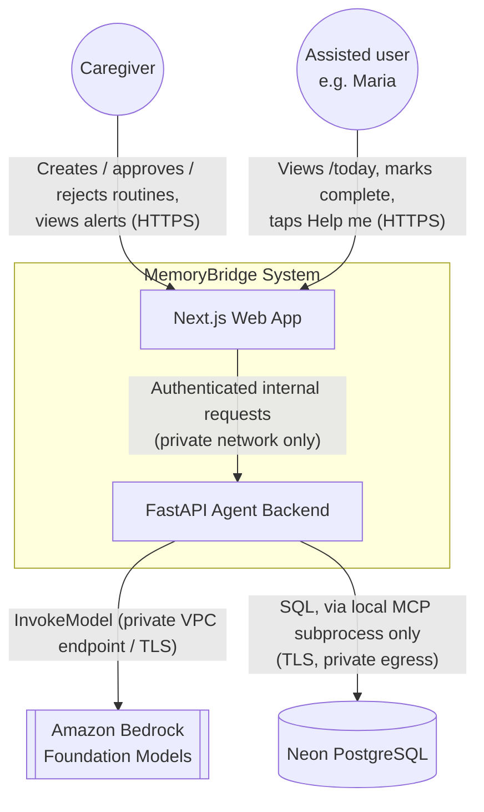
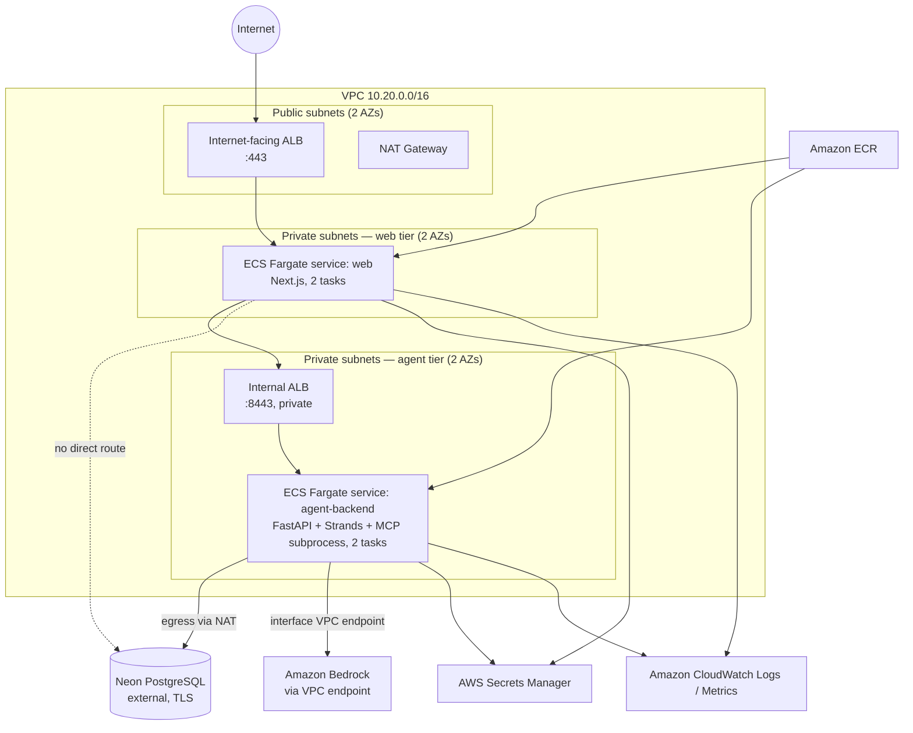
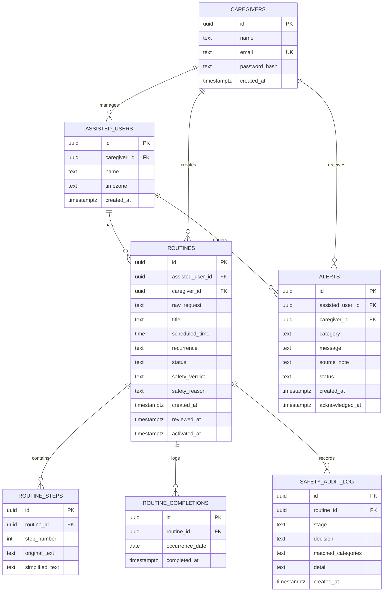
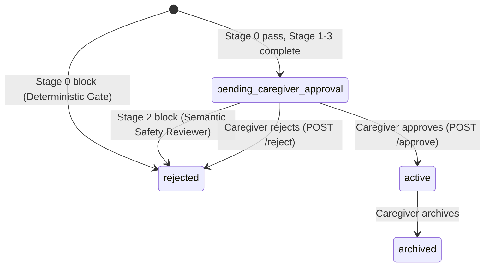
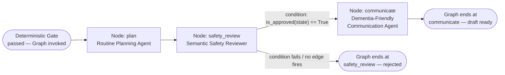
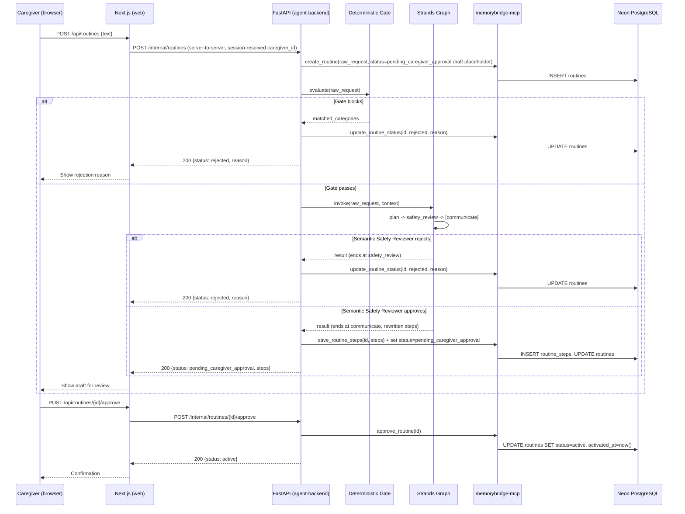
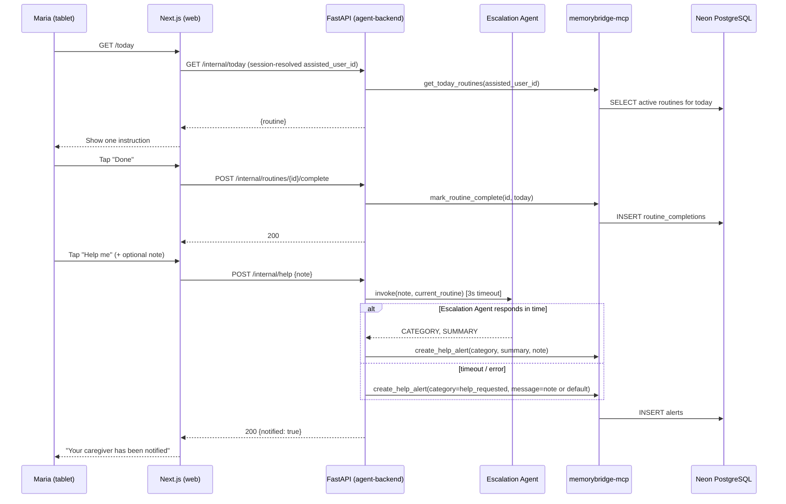

# MemoryBridge — Architecture

**Document type:** System architecture source of truth
**Version:** 1.0
**Date:** 2026-09-10
**Status:** Approved for hackathon build
**Owner:** Bharath
**Companion documents:** [`project_overview.md`](./project_overview.md) (product) · [`implementation.md`](./implementation.md) (build plan)

---

## 1. Architecture Principles

These principles are binding on every design decision in this document. Where a later section appears to conflict with one of these, the principle wins and the section is wrong.

1. **Deterministic before probabilistic.** Every safety-relevant decision has a non-AI code path that runs first. AI is only ever asked to reason inside a boundary that code has already drawn.
2. **Agents transform; code persists.** No Strands `Agent` object in this system is ever given a database write tool. All state mutation (creating a draft, approving it, activating it, logging an alert) is performed by deterministic FastAPI application code, never by an agent's autonomous tool call. This is stronger than "human-in-the-loop for activation" — it means an agent is *structurally incapable* of writing to the database at all, regardless of what it is asked or tricked into doing.
3. **Least-privilege tool binding.** An agent receives only the specific tools its role requires, filtered by name at construction time — never the full MCP tool catalog.
4. **The application never talks to the database directly, and neither does the agent layer — the MCP server does.** Postgres credentials exist in exactly one place: the MCP server process's environment, injected from AWS Secrets Manager. Neither the FastAPI route handlers nor any agent holds a connection string.
5. **Identity stays server-side.** Caregiver and assisted-user identifiers never reach browser-executed JavaScript. The browser holds an opaque, httpOnly session cookie only.
6. **No silent autonomy.** No component in this architecture is capable of placing a phone call, sending an SMS, sending an email to a third party, moving money, or actuating a physical device. This is not a prompt constraint; it is the absence of any such integration or credential anywhere in the system.

---

## 2. System Context



MemoryBridge has exactly two external dependencies: **Amazon Bedrock** (LLM inference) and **Neon PostgreSQL** (persistence). It has zero integrations with telephony, messaging, payment, or smart-home providers — by omission, not by configuration flag.

---

## 3. High-Level Component Architecture

```mermaid
flowchart LR
    subgraph Browser["Caregiver / Maria's browser or tablet"]
        UI[Next.js client]
    end

    subgraph WebSvc["Next.js Web App  (public ECS Fargate service)"]
        BFF[Route Handlers /<br/>Server Components<br/>— session cookie holder]
    end

    subgraph BackendSvc["FastAPI Agent Backend  (private ECS Fargate service)"]
        Router[FastAPI routers]
        Gate[Stage 0 — Deterministic<br/>Prohibited-Category Gate]
        Graph[Strands Agents Graph<br/>plan → safety_review → communicate]
        Esc[Escalation Agent<br/>(single Strands Agent)]
        MCPClient[Strands MCP Client<br/>— stdio transport]
    end

    subgraph MCPProc["Local MCP Subprocess (same task, isolated process)"]
        MCPServer[memorybridge-mcp<br/>read tools + write tools]
    end

    Neon[(Neon PostgreSQL)]
    Bedrock[[Amazon Bedrock]]

    UI <--> BFF
    BFF <-- "Private VPC networking only" --> Router
    Router --> Gate
    Gate -- "pass" --> Graph
    Gate -- "block" --> Router
    Router --> Esc
    Graph -- "read-only context tools" --> MCPClient
    Esc -. "no tools bound" .- Esc
    Router -- "all writes:<br/>create/approve/reject/activate/alert" --> MCPClient
    MCPClient -- "stdio (loopback, in-process)" --> MCPServer
    MCPServer -- "TLS, single credential" --> Neon
    Graph -- "InvokeModel" --> Bedrock
    Esc -- "InvokeModel" --> Bedrock
```

---

## 4. AWS Deployment Topology

MemoryBridge runs entirely on **AWS Fargate** inside a single VPC, split into a public web tier and a private agent-backend tier.



### 4.1 Compute

| Service | ECS launch type | Task CPU / Memory | Desired count | Subnets | Public IP |
|---|---|---|---|---|---|
| `web` (Next.js) | Fargate | 0.5 vCPU / 1 GB | 2 | Private (web tier) | No — reached only via internet-facing ALB |
| `agent-backend` (FastAPI + Strands + MCP subprocess) | Fargate | 1 vCPU / 2 GB | 2 | Private (agent tier) | No — reached only via internal ALB, from `web` service only |

Both services run behind Application Load Balancers rather than being assigned public IPs directly. `web` is the only service reachable from the internet; `agent-backend` is reachable only from `web`'s security group, enforced at the security-group layer (§4.3), not merely by network topology.

### 4.2 Why the FastAPI backend is never public

The project requirement that "application-level caregiver and assisted-user identities remain server-side and are not exposed to the browser" is implemented as follows: the Next.js service is the **only** component the browser ever addresses. It acts as a backend-for-frontend (BFF) — it holds the caregiver's or assisted-user's session cookie (httpOnly, `SameSite=Lax`, `Secure`), resolves that cookie to an internal `caregiver_id` / `assisted_user_id` **on the server**, and forwards an authenticated, server-to-server request to `agent-backend` over the internal ALB. The browser's JavaScript bundle never contains the internal backend's hostname, never receives a raw `caregiver_id` or `assisted_user_id`, and never holds a Bedrock or database credential of any kind.

### 4.3 Networking and security groups

| Security group | Attached to | Inbound allowed from | Inbound port |
|---|---|---|---|
| `sg-alb-web` | Internet-facing ALB | `0.0.0.0/0` | 443 |
| `sg-web-task` | `web` Fargate tasks | `sg-alb-web` only | 3000 |
| `sg-alb-internal` | Internal ALB | `sg-web-task` only | 8443 |
| `sg-agent-task` | `agent-backend` Fargate tasks | `sg-alb-internal` only | 8000 |
| `sg-agent-task` (egress) | `agent-backend` Fargate tasks | → NAT Gateway (Neon TLS 5432/443), → Bedrock VPC endpoint (443) | outbound only |
| `sg-web-task` (egress) | `web` Fargate tasks | → `sg-alb-internal` only | outbound only |

`web` has **no egress rule to Neon or Bedrock at all** — it is not merely discouraged from calling them, it cannot, at the security-group level.

### 4.4 IAM

| Role | Attached to | Key permissions | Explicitly denied |
|---|---|---|---|
| `memorybridge-web-task-role` | `web` ECS tasks | `secretsmanager:GetSecretValue` (session-secret only), CloudWatch Logs write | `bedrock:*`, any RDS/Postgres network policy, Secrets Manager access to the database secret |
| `memorybridge-agent-task-role` | `agent-backend` ECS tasks | `bedrock:InvokeModel` / `bedrock:InvokeModelWithResponseStream` scoped to the two approved model IDs (§12), `secretsmanager:GetSecretValue` (database URL, session secret), CloudWatch Logs write | Any IAM action implying telephony, SNS, SES, or device-control services (these are simply never granted — there is no policy statement to deny) |
| `memorybridge-ecs-execution-role` | Both services (task startup only) | ECR pull, CloudWatch Logs group creation, Secrets Manager retrieval for injected env vars | — |

### 4.5 Secrets

| Secret (Secrets Manager) | Contents | Consumed by |
|---|---|---|
| `memorybridge/database-url` | Neon PostgreSQL connection string (TLS, `sslmode=require`) | `agent-backend` task only, injected as `DATABASE_URL` and passed to the MCP subprocess's environment |
| `memorybridge/session-secret` | HMAC signing key for session cookies | Both `web` (issues/verifies cookies) and `agent-backend` (verifies the internal service token forwarded by `web`) |

---

## 5. Data and Network Boundary Rules

| Rule | Enforced by |
|---|---|
| Browser JS never sees `caregiver_id` / `assisted_user_id` | Session cookie pattern (§4.2); enforced by code review + an integration test that asserts these fields are absent from every `web` API response body |
| `web` cannot reach Neon or Bedrock | Security group egress rules (§4.3) — no route exists |
| `agent-backend` cannot reach Neon directly | Only the MCP subprocess holds `DATABASE_URL`; FastAPI route handlers and Strands `Agent` objects are never given the raw connection string |
| No Strands `Agent` holds a database write tool | Tool binding is filtered by name at agent construction (§7.4); enforced by a unit test that asserts each agent's `tools` list contains zero write-tool names |
| A routine cannot become `active` without a caregiver's `POST /api/caregiver/routines/{id}/approve` call | Application-layer state machine (§8.1); enforced by an integration test asserting `/today` returns nothing for a `pending_caregiver_approval` routine |

---

## 6. Data Architecture

### 6.1 Entity-relationship diagram



Full column-level DDL is in `implementation.md §5`.

### 6.2 `routines.status` state machine



A row is inserted into `routines` **the moment a caregiver request is received**, before Stage 0 runs, so that every request — including instantly-blocked ones — is visible in the caregiver's history with a reason. This is a deliberate transparency decision: the caregiver never wonders whether MemoryBridge "saw" a request that got blocked.

---

## 7. Agent Architecture

### 7.1 Framework and orchestration primitive

MemoryBridge uses the **Strands Agents SDK** (`strands-agents`, Python) as required by the hackathon. For the routine-creation pipeline (Stages 1–3), the SDK's **`Graph`** primitive (`strands.multiagent.GraphBuilder`) is used, not `Swarm`, `Workflow`, or a plain `Agents-as-Tools` hierarchy. The reasoning, per Strands' own pattern-selection guidance:

| Question | Answer for this pipeline | Implication |
|---|---|---|
| Is the execution path known in advance? | Yes — plan → review → (conditionally) rewrite is fixed; it never varies by request. | Rules out `Swarm` and `Agents-as-Tools`, which are for paths *discovered* at runtime. |
| Does the process need a conditional branch? | Yes — the routine only reaches the Communication Agent if the Semantic Safety Reviewer approves it. | Rules out `Workflow` (dependencies only, no branching); requires `Graph`'s conditional edges. |
| Is a human-in-the-loop checkpoint needed as a first-class seam? | Yes — approval is a gate on top of the pipeline's output. | `Graph` is the pattern whose documentation explicitly recommends a node-plus-condition as the natural shape for approval gates. |
| Is an audit trail of exactly what ran required? | Yes — every safety decision must be reconstructable. | `Graph`'s `execution_order`, per-node `results`, and `accumulated_usage` give this for free. |

This mirrors Strands' own worked example for "known path, conditional gate, bounded audit requirement," which the documentation maps directly to `Graph`. The Escalation Agent (§7.5) is a single `Agent` with no orchestration primitive, since it is a one-step task with no branching.

### 7.2 Graph topology



Entry point: `plan`. The graph is acyclic; `set_max_node_executions(3)` is set regardless, as a defense-in-depth cap consistent with the SDK's general guidance to always bound worst-case execution, even on topologies with no loops. `set_execution_timeout(45)` (seconds) and `set_node_timeout(20)` bound total and per-node wall-clock time respectively.

### 7.3 Agent-by-agent specification

| | Routine Planning Agent | Semantic Safety Reviewer | Dementia-Friendly Communication Agent | Escalation Agent |
|---|---|---|---|---|
| Graph node ID | `plan` | `safety_review` | `communicate` | *(not in graph — invoked directly)* |
| Purpose | Extract activity, time, recurrence, and an ordered step list from the caregiver's raw request | Independently judge the *planned* routine for unsafe or prohibited intent, including intent only visible when steps are combined | Rewrite approved steps into short, one-action, respectful, low-cognitive-load language | Interpret Maria's help request (and optional note) into a short, structured summary for the caregiver's alert |
| Input | Raw caregiver text + read-only context (existing routines for that assisted user, to avoid time conflicts) | The structured output of `plan` | The structured, safety-approved output of `safety_review` | Maria's optional free-text note + the routine she was on (if any) |
| Output | Structured `RoutinePlan` (title, time, recurrence, ordered steps) | A verdict block: `VERDICT: APPROVED\|REJECTED`, `REASON:`, `FLAGGED_CATEGORIES:` | Rewritten step text, one action per step, ≤12 words per step | A verdict block: `CATEGORY:`, `SUMMARY:` |
| Tools bound | `get_assisted_user_profile`, `get_existing_routines` (both **read-only**) | None | None | None |
| Model tier | Fast (§12) | Reasoning (§12) | Reasoning (§12) | Fast (§12) |
| Node/agent timeout | 20s (graph node timeout) | 20s | 20s | 3s hard timeout, with a deterministic fallback (§7.5) |
| Can write to the database | **No — never** | **No — never** | **No — never** | **No — never** |

Full system prompts are specified verbatim in `implementation.md §7`.

### 7.4 Tool binding — least privilege in code

```python
from strands.tools.mcp import MCPClient
from mcp import stdio_client, StdioServerParameters

mcp_client = MCPClient(
    lambda: stdio_client(
        StdioServerParameters(command="python", args=["-m", "memorybridge_mcp.server"])
    )
)

READ_ONLY_TOOLS = {"get_assisted_user_profile", "get_existing_routines"}

with mcp_client:
    all_tools = mcp_client.list_tools_sync()
    planning_tools = [t for t in all_tools if t.tool_name in READ_ONLY_TOOLS]
    # planning_tools is passed only to the Routine Planning Agent.
    # Every other agent in the system is constructed with tools=[] — an
    # empty list — so it has no mechanism to call the MCP server at all.
```

A unit test (`tests/test_tool_binding.py`, detailed in `implementation.md §13`) asserts, for every `Agent` instance the application constructs, that its bound tool names are a subset of `READ_ONLY_TOOLS`. This test fails the build if a future change accidentally grants a write tool to any agent.

### 7.5 Graph wiring (reference implementation)

```python
from strands import Agent
from strands.multiagent import GraphBuilder

def is_approved(state) -> bool:
    review = state.results.get("safety_review")
    if review is None:
        return False
    return "VERDICT: APPROVED" in str(review.result)

def build_routine_graph(planning_tools: list) -> "Graph":
    plan_agent = Agent(
        name="plan",
        system_prompt=ROUTINE_PLANNING_SYSTEM_PROMPT,  # implementation.md §7.1
        tools=planning_tools,
        model=FAST_MODEL_ID,
    )
    reviewer_agent = Agent(
        name="safety_review",
        system_prompt=SAFETY_REVIEWER_SYSTEM_PROMPT,   # implementation.md §7.2
        tools=[],
        model=REASONING_MODEL_ID,
    )
    comms_agent = Agent(
        name="communicate",
        system_prompt=COMMUNICATION_SYSTEM_PROMPT,     # implementation.md §7.3
        tools=[],
        model=REASONING_MODEL_ID,
    )

    builder = GraphBuilder()
    builder.add_node(plan_agent, "plan")
    builder.add_node(reviewer_agent, "safety_review")
    builder.add_node(comms_agent, "communicate")
    builder.add_edge("plan", "safety_review")
    builder.add_edge("safety_review", "communicate", condition=is_approved)
    builder.set_entry_point("plan")
    builder.set_execution_timeout(45)
    builder.set_node_timeout(20)
    builder.set_max_node_executions(3)
    return builder.build()
```

### 7.6 Escalation Agent — deterministic fail-open design

Because a help request is, by definition, time-sensitive, the Escalation Agent must never be the reason an alert is delayed or lost:

```mermaid
flowchart TD
    HelpTap([Maria taps "Help me"]) --> Invoke["Invoke Escalation Agent<br/>3s hard timeout"]
    Invoke -- "Returns CATEGORY + SUMMARY within 3s" --> RichAlert["Application code creates alert<br/>with agent-derived category + summary"]
    Invoke -- "Timeout or any exception" --> FallbackAlert["Application code creates alert<br/>immediately, category=help_requested,<br/>message=Maria's raw note or a generic default"]
    RichAlert --> Notify([Caregiver console<br/>shows the alert])
    FallbackAlert --> Notify
```

In both branches, the alert row is written by deterministic FastAPI code calling the MCP write tool `create_help_alert` — the Escalation Agent itself never calls it. The LLM's only job is to make the alert more informative when it can; the alert's existence never depends on the LLM succeeding.

---

## 8. Sequence Diagrams

### 8.1 Routine creation and approval



### 8.2 Maria's `/today` view and Help me



---

## 9. MCP Server Tool Contract

`memorybridge-mcp` is a local MCP server, started as a subprocess of `agent-backend` at process startup (stdio transport — no network port, no exposure outside the task). It is the **only** component in the system holding a Postgres credential.

| Tool | Type | Callable by | Parameters | Returns |
|---|---|---|---|---|
| `get_assisted_user_profile` | Read | Routine Planning Agent | `assisted_user_id` | Name, timezone, active routine titles |
| `get_existing_routines` | Read | Routine Planning Agent | `assisted_user_id` | List of active routines with scheduled times (for conflict avoidance) |
| `create_routine` | Write | Application code only | `assisted_user_id, caregiver_id, raw_request` | New `routines` row id, status `pending_caregiver_approval` (placeholder) |
| `save_routine_steps` | Write | Application code only | `routine_id, steps[]` | Confirmation |
| `update_routine_status` | Write | Application code only | `routine_id, status, safety_verdict, safety_reason` | Confirmation |
| `approve_routine` | Write | Application code only | `routine_id, caregiver_id` | Confirmation, `activated_at` |
| `reject_routine` | Write | Application code only | `routine_id, caregiver_id, reason` | Confirmation |
| `get_today_routines` | Read | Application code only | `assisted_user_id, date` | Active routines scheduled for that date |
| `mark_routine_complete` | Write | Application code only | `routine_id, occurrence_date` | Confirmation |
| `create_help_alert` | Write | Application code only | `assisted_user_id, caregiver_id, category, message, source_note` | New `alerts` row id |
| `get_alerts` | Read | Application code only | `caregiver_id` | List of alerts, newest first |
| `log_safety_decision` | Write | Application code only | `routine_id, stage, decision, matched_categories, detail` | Confirmation |

Full function signatures and the server's Python implementation outline are in `implementation.md §6`.

---

## 10. API Contract (Next.js → FastAPI, internal)

All endpoints below are on the private internal ALB and are reachable only from the `web` service's security group. They require a signed internal service token (HMAC, `memorybridge/session-secret`) plus the resolved subject id as a header, set by `web` after resolving the browser's session cookie.

| Method | Path | Subject | Request body | Response |
|---|---|---|---|---|
| `POST` | `/internal/routines` | Caregiver | `{ raw_request: string }` | `{ id, status, steps?, reason? }` |
| `GET` | `/internal/routines` | Caregiver | — | `[{ id, title, status, scheduled_time, ... }]` |
| `POST` | `/internal/routines/{id}/approve` | Caregiver | — | `{ id, status: "active" }` |
| `POST` | `/internal/routines/{id}/reject` | Caregiver | `{ reason?: string }` | `{ id, status: "rejected" }` |
| `GET` | `/internal/alerts` | Caregiver | — | `[{ id, category, message, created_at, status }]` |
| `POST` | `/internal/alerts/{id}/acknowledge` | Caregiver | — | `{ id, status: "acknowledged" }` |
| `GET` | `/internal/today` | Assisted user | — | `{ routine: {...} \| null }` |
| `POST` | `/internal/routines/{id}/complete` | Assisted user | — | `{ id, completed: true }` |
| `POST` | `/internal/help` | Assisted user | `{ note?: string }` | `{ notified: true }` |

Full request/response JSON Schemas are in `implementation.md §10`.

---

## 11. Prohibited-Category Deterministic Gate — architectural placement

The gate is **not** a Graph node (Graph nodes are agents; the gate is deliberately not an agent). It runs as plain Python inside the FastAPI request handler, before the Strands `Graph` object is invoked at all — meaning a blocked request results in **zero** calls to Amazon Bedrock. This is the literal implementation of "Safety First, AI Second": the ordering is enforced by control flow, not by instruction. The rule table, matcher implementation, and adversarial test cases are specified in `implementation.md §8`.

---

## 12. Model Provider and Prompting Strategy

Strands Agents SDK uses Amazon Bedrock as its default model provider; MemoryBridge does not override this. Two model tiers are used, selected per agent by task difficulty and latency sensitivity (configured via environment variables, not hardcoded — see `implementation.md §12`):

| Tier | Env var | Used by | Rationale |
|---|---|---|---|
| Reasoning | `BEDROCK_MODEL_ID_REASONING` | Semantic Safety Reviewer, Dementia-Friendly Communication Agent | Both tasks require nuanced judgment (implicit unsafe intent; genuinely simple, respectful phrasing for a vulnerable reader) where a stronger Claude-class model on Bedrock is justified. |
| Fast | `BEDROCK_MODEL_ID_FAST` | Routine Planning Agent, Escalation Agent | Structured extraction and short summarization are latency-sensitive (Routine Planning sits on the caregiver's critical path; Escalation has a 3-second hard budget) and do not require the largest available model. |

Both tiers default to a Claude-class model on Bedrock; the exact model ID is a deployment-time configuration value (`implementation.md §12`) so it can be upgraded without a code change, and the IAM policy in §4.4 scopes `bedrock:InvokeModel` to exactly the two configured model IDs — no agent can silently be pointed at an unapproved model by changing an environment variable an operator didn't intend to change, since the IAM policy itself would deny the call.

Temperature is fixed low (`0.2`) for the Semantic Safety Reviewer and Routine Planning Agent, where consistency of judgment matters more than variety. The Dementia-Friendly Communication Agent uses a slightly higher temperature (`0.4`) to avoid mechanically repetitive phrasing across routines while staying well short of creative-writing settings.

---

## 13. Security Architecture

| Concern | Design |
|---|---|
| Authentication | Caregiver: email + password (bcrypt-hashed), session cookie issued by `web`. Assisted user: device-bound, long-lived session provisioned by the caregiver during a one-time pairing flow in the caregiver console — Maria never sees a login screen, consistent with the calm-technology principle. |
| Authorization | Every internal API call carries a subject type (`caregiver` \| `assisted_user`) and a resolved subject id, set only by `web` after cookie verification. `agent-backend` re-verifies the internal service token on every request; a request without a valid token is rejected before any routing occurs. |
| Data in transit | TLS everywhere: browser↔ALB (public cert via ACM), `web`↔internal ALB (private cert), `agent-backend`↔Neon (`sslmode=require`), `agent-backend`↔Bedrock (VPC interface endpoint, TLS). |
| Data at rest | Neon PostgreSQL encryption at rest (provider-managed). Secrets Manager encrypts secrets with a customer-managed KMS key. |
| PII / health-adjacent data minimization | `routines.raw_request` and `routine_steps` may contain health-adjacent context (e.g., a caregiver mentioning a diagnosis in passing, even on a benign request). This data is not sent anywhere beyond Bedrock inference and Postgres storage — no analytics pipeline, no logging of full request bodies to third-party services. CloudWatch logs capture structured metadata (routine id, status, latency) but not raw caregiver free text, to limit exposure of incidentally-shared health context. |
| Prompt-injection resistance | Caregiver free text is the only untrusted input reaching a model. The Routine Planning Agent's system prompt explicitly instructs it to treat the caregiver's text as data to extract from, never as instructions that change its own role, tool access, or output schema. Because no agent in the pipeline holds a write tool (Principle 2, §1), a successful prompt injection has no path to a database mutation even in the worst case — it can at most produce a malformed draft, which still requires caregiver approval before it is visible to anyone. |
| Audit logging | Every gate decision (deterministic and semantic) is written to the append-only `safety_audit_log` table via `log_safety_decision`, called by application code, never by an agent. |

---

## 14. Non-Functional Requirements

| Category | Requirement |
|---|---|
| Availability | Two Fargate tasks per service across two Availability Zones; no single-AZ dependency for compute. Neon PostgreSQL's managed availability is inherited as-is (single primary in v1; documented as a known limitation in `implementation.md §17`). |
| Latency | End-to-end routine-creation (benign request, Stage 0 through Stage 4-ready) target: p95 under 12 seconds (`project_overview.md §10`). Escalation Agent: hard 3-second timeout with deterministic fallback (§7.6). |
| Scalability | Both ECS services are configured for target-tracking auto scaling on CPU utilization (target 60%), min 2 / max 6 tasks. Not exercised in the hackathon demo but configured as production-readiness evidence for the Technical Implementation score. |
| Observability | Structured JSON logs to CloudWatch from both services. The Graph's `execution_order`, per-node `results` status, and `accumulated_usage` are logged for every invocation, keyed by `routine_id`, giving a complete per-routine trace of which agents ran and what they cost. |
| Cost control | Fast-tier model used wherever task difficulty allows (§12); Bedrock IAM policy scoped to exactly two model IDs; Fargate task sizes chosen at the smallest size that met p95 latency in local testing (`implementation.md §4`). |

---

## 15. Failure Modes and Mitigations

| Failure mode | Impact if unmitigated | Mitigation |
|---|---|---|
| A caregiver phrases a prohibited request in a way the deterministic gate misses | An unsafe routine could reach the Semantic Safety Reviewer | The Semantic Safety Reviewer is an independent second check, not a redundant copy of the same keyword logic (§7.3); it evaluates the *planned, structured* routine for meaning, not just the raw text |
| A Graph condition function silently evaluates `False` due to unexpected model phrasing | The pipeline appears to "hang" or produce no draft, with no visible error | The Semantic Safety Reviewer's system prompt mandates the exact `VERDICT: APPROVED\|REJECTED` marker; a unit test asserts `is_approved()` behaves correctly against a corpus of recorded model outputs, and any response missing the marker is treated as `REJECTED` by default (fail-closed, not fail-open, for this specific check) |
| Bedrock throttling or transient error | A routine-creation request fails mid-pipeline | FastAPI catches Graph invocation errors, marks the routine `rejected` with reason `"temporarily_unavailable"`, and the caregiver console offers a retry action; no partial or corrupted draft is ever surfaced |
| MCP subprocess crashes | `agent-backend` cannot read or write any data | ECS Fargate task health check includes an MCP-liveness probe; on failure, the task is recycled by ECS, and requests in flight return a 503 rather than an inconsistent write |
| Escalation Agent fails or times out | A help request could be delayed | Deterministic fallback path (§7.6) guarantees the alert row is created regardless |
| A caregiver never responds to a pending draft | The assisted user never receives a routine they asked for | Out of scope for v1 notification logic; documented in `project_overview.md §9.2`. The draft simply remains visible in the caregiver console indefinitely under `pending_caregiver_approval` until acted on. |

---

## 16. Technology Stack Summary

| Layer | Technology | Notes |
|---|---|---|
| Agent orchestration | Strands Agents SDK (Python), `strands.multiagent.GraphBuilder` | Required by the hackathon |
| Model provider | Amazon Bedrock | Strands' default provider; two model tiers (§12) |
| Backend service | FastAPI (Python 3.12) | Private service; hosts the Strands Graph, the deterministic gate, and the MCP client |
| Data access boundary | Local MCP server (Python `mcp` SDK, stdio transport) | Sole holder of the Postgres credential |
| Database | Neon PostgreSQL (serverless Postgres) | External managed service, TLS-only |
| Frontend | Next.js (App Router, Server Components + Route Handlers) | Public service; BFF pattern; renders both the caregiver console and `/today` |
| Compute / deployment | AWS Fargate (ECS), behind ALBs | Two services: `web` (public), `agent-backend` (private) |
| Secrets | AWS Secrets Manager | Database URL, session secret |
| Observability | Amazon CloudWatch Logs / Metrics | Structured logs, Graph execution traces |
| Optional enhancement | Amazon Bedrock AgentCore Runtime | Documented alternative deployment path (§17, ADR-003); not the committed v1 path |

---

## 17. Architecture Decision Records

**ADR-001 — Use Strands `Graph`, not `Swarm`, `Workflow`, or `Agents-as-Tools`, for the routine-creation pipeline.**
*Decision:* `Graph`. *Reasoning:* the execution path (plan → review → conditionally rewrite) is fully known in advance and requires a conditional branch and an auditable, code-defined gate — the exact combination the Strands documentation identifies as `Graph`'s use case, distinct from `Swarm`'s emergent peer coordination or `Workflow`'s dependency-only, branch-free pipelines. *Status:* Accepted. *Consequence:* the pipeline is fully unit-testable without invoking a model (the condition function is plain Python), at the cost of not being able to handle a genuinely unpredictable planning path — an acceptable trade-off, since routine creation should not behave unpredictably.

**ADR-002 — No Strands `Agent` is ever given a database write tool; all writes happen in deterministic application code.**
*Decision:* Agents are pure transformers (text/structured-data in, text/structured-data out); FastAPI route handlers perform every `INSERT`/`UPDATE` via the MCP client, directly, outside of any agent's tool-use loop. *Reasoning:* this exceeds the stated requirement ("agents may create a draft, but they cannot activate it") by removing write capability from the agent layer entirely, closing off an entire class of prompt-injection risk (§13) rather than relying on an agent choosing not to call a write tool. *Status:* Accepted. *Consequence:* slightly more application code (the backend must translate each Graph result into explicit persistence calls) in exchange for a database-write attack surface of zero inside the LLM-driven layer.

**ADR-003 — Deploy on AWS Fargate for v1; document Amazon Bedrock AgentCore Runtime as the recommended production evolution.**
*Decision:* The committed v1 deployment target is AWS Fargate, per the project's explicit deployment requirement. Amazon Bedrock AgentCore Runtime — the AWS-managed, serverless runtime purpose-built for agent workloads, and a path the hackathon's own judging criteria call out as strengthening the Technical Implementation score — is documented as the natural next deployment target, since the Strands application code behind a single `@app.entrypoint` is portable to AgentCore without a rewrite. *Status:* Accepted for v1; AgentCore migration is future work, not a hedge — see `implementation.md §12.3` for the concrete migration outline. *Reasoning:* the project's own requirements name Fargate explicitly and describe a specific multi-service topology (public web app, private backend) that Fargate expresses directly; committing to Fargate for the hackathon submission avoids re-deriving that topology on a newer runtime under a four-day deadline, while the AgentCore path is still credited in the write-up.

**ADR-004 — Deterministic gate blocks the entire `medication_or_dosage` category, not just "dosage changes."**
*Decision:* Any routine content referencing medication administration, timing, or dosage is blocked outright, including plain reminders to take an already-prescribed medication at its normal time. *Reasoning:* documented in full in `project_overview.md §9.1`, item 1 — distinguishing a benign reminder from an unsafe dosage implication is itself a clinical judgment this prototype is not positioned to make safely, so the category is excluded wholesale rather than partially supported. *Status:* Accepted.

---

## 18. Diagram and Notation Legend

- Solid arrows: synchronous request/response.
- Dashed arrows: explicitly denied or non-existent paths, shown for clarity.
- `[[ ]]` boxes: managed external AWS services (no application code runs inside them).
- `( )` boxes: external human actors.
- All Mermaid diagrams in this document render natively on GitHub and satisfy the hackathon submission's "Include an Architecture Diagram" requirement (`implementation.md §16`).
